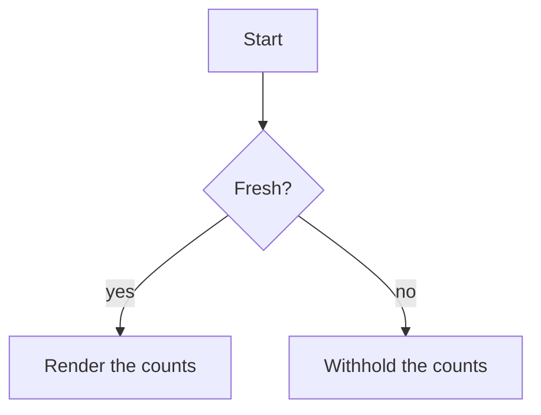
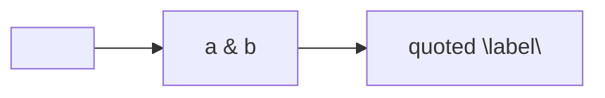

# Diagrams

A Mermaid fence renders twice: once as the block a browser turns into a picture, and once as the
source a reader with no browser can still read.



## A diagram whose source looks like HTML

Everything inside the fence is escaped in both copies, so a label that looks like a tag reaches the
page as text.



## A sequence diagram, indented under a list item

- The handoff:

  ```mermaid
  sequenceDiagram
      Session->>Kernel: savepoint --verify
      Kernel-->>Session: PASS
  ```

## A fence that is not a diagram

```mermaidish
this info string is not the word mermaid, so it is ordinary code
```

## An empty diagram fence

```mermaid
```
