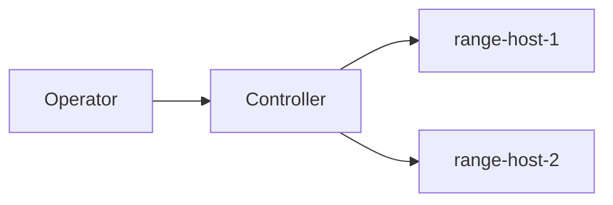

# Range teardown runbook

> Read the whole runbook before running anything. Every command below is fixture text; nothing in this
> repository executes it.

## Inventory

| host | role | address | state |
| --- | --- | ---: | :---: |
| range-host-1 | controller | 10.0.0.11 | up |
| range-host-2 | target | 10.0.0.12 | up |
| template-host | image source | 0.0.0.0 | held |

## Preconditions

- [x] The remote Terraform backend is reachable
- [x] Somebody who can approve a teardown is awake
- [ ] The range has been snapshotted

## Steps

1. Confirm what the plan would change.

   ```bash
   terraform plan -no-color -out=plan.bin
   terraform show -json plan.bin | jq '.resource_changes[].change.actions'
   ```

2. Drain the hosts.

   ```bash
   ansible -i inventory/range.yml all -m shell -a 'systemctl stop range-agent'
   ```

3. Destroy, and read the prompt rather than typing yes from memory.

   ```bash
   terraform destroy
   ```

## Rollback

If step 2 fails partway, bring the agents back before touching Terraform:

```bash
ansible -i inventory/range.yml all -m shell -a 'systemctl start range-agent'
```

## Network



## Notes

The teardown script lives at `scripts/teardown.sh`; read it once before you trust it, and see
[the setup guide](setup.md) for how the range is stood back up.
